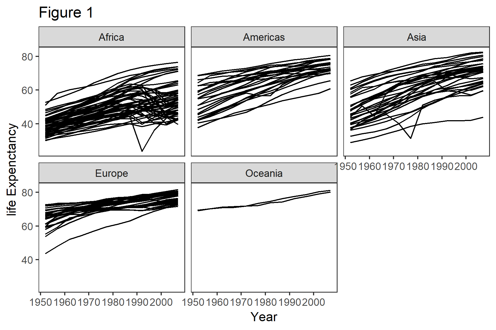

```{r setup, include=FALSE}
knitr::opts_chunk$set(echo = TRUE)
```
#load the data

```{r}
dat <- read.csv("data/gapminder_data.csv")
summary(dat)
```

#plot the data

we need to load the package:
```{r}
library(ggplot2)
```

```{r}
ggplot(data=dat,mapping=aes(x=year,y=lifeExp,by=country, color=continent))+ facet_wrap(~ continent)+
  geom_line()+theme_bw()
```

```{r, fig.cap="Life exp vs. year, for each country"}

```


## R Markdown

This is an R Markdown document. Markdown is a simple formatting syntax for authoring HTML, PDF, and MS Word documents. For more details on using R Markdown see <http://rmarkdown.rstudio.com>.

When you click the **Knit** button a document will be generated that includes both content as well as the output of any embedded R code chunks within the document. You can embed an R code chunk like this:


## Including Plots

You can also embed plots, for example:

```{r pressure, echo=FALSE}
plot(pressure)
```

Note that the `echo = FALSE` parameter was added to the code chunk to prevent printing of the R code that generated the plot.
